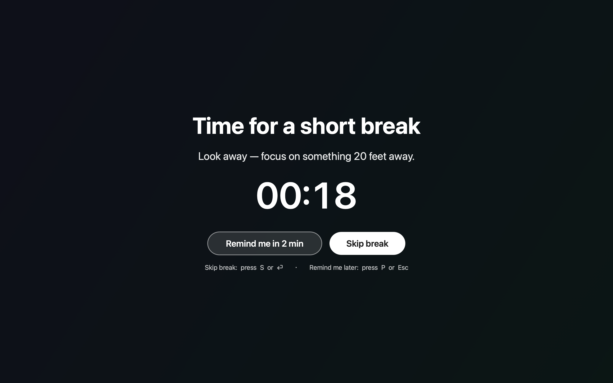

# Stretch

A tiny native macOS menu-bar app that reminds you to take breaks — like
[Stretchly](https://hovancik.net/stretchly/), but built from scratch in Swift.



> The full-screen break overlay: a countdown, a suggestion, and two actions —
> **Skip break** or **Remind me in 2 min** (mouse or keyboard).

- **Short breaks** every 20 minutes (look away, rest your eyes) — 20s by default.
- **Long breaks** every 60 minutes (stand up, move) — 5 min by default.
- Breaks appear as a **dimmed full-screen overlay** on every display, with a
  countdown and two actions:
  - **Skip break** (permanent) — click, or press **S** / **Return**.
  - **Remind me in 2 min** (snooze) — click, or press **P** / **Esc**.
- **Local history** — open **History…** from the menu to see breaks taken, rest
  time, permanent skips, and snoozes for today / last 7 days / 30 days / all time.
- **Away-aware** — if the screen is locked for more than 30 seconds, that counts
  as a rest: the next-break countdown and the long-break cycle reset on unlock,
  so you're not nagged the moment you return. (An active **Pause** is respected.)
- **Bedtime paper mode** — at a time you set (default 21:40–07:00), the screen
  gets a soft, click-through paper wash (warm, slightly dim, faint grain) so
  the Mac feels quieter and reminds you to sleep. No Screen Recording
  permission. Turn on in **Preferences…**, or use the menu to enable / dismiss
  until morning / snooze 15–60 min. Break overlays still appear on top when due.
- Lives in the **menu bar** with a live countdown to the next break.
- No Dock icon, no Electron, ~2 MB, no runtime dependencies.

## Requirements

- macOS 13 (Ventura) or later
- Swift toolchain (`swift --version`) — the Command Line Tools are enough; full
  Xcode is not required.

## Build & run

```sh
./build.sh            # compiles and produces Stretch.app
open Stretch.app      # launches it (look for the icon in the menu bar)
```

To rebuild and relaunch during development:

```sh
./build.sh && killall Stretch 2>/dev/null; open Stretch.app
```

You can also run the raw binary without bundling (no app icon hiding):

```sh
swift run
```

## Menu

- **Take a short / long break now** — trigger a break immediately.
- **Reset timer** — restart the countdown to the next break.
- **Pause** — for 30 min, 1 hour, or indefinitely; **Resume** to continue.
- **Bedtime paper** — status line, turn on / dismiss until morning, snooze.
- **Medications…** — add/edit medications & supplements to be reminded about.
- **History…** — break stats over time (stored locally, see below).
- **Preferences…** — change intervals, durations, bedtime window, meal times, and launch-at-login.

## History

Every break is logged to `~/Library/Application Support/Stretch/history.json`
as one of: `completed` (you rested), `skipped` (permanent skip), or `snoozed`
(temporary). The History window aggregates these into counts and total rest time
for Today, Last 7 days, Last 30 days, and All time. Nothing leaves your machine.

## Medications & supplements

Stretch can also remind you to take medication or supplements, riding the breaks
you already get so there's no extra interruption. Add them via **Medications…**
in the menu (name, oral/topical, schedule, an optional note like "with food").

Two schedule types:

- **Meal-relative** — before / after / with breakfast, lunch, or dinner, plus an
  offset (e.g. "30 min before lunch"). Meal times are set in **Preferences**.
- **N× per day** — a count spread across your waking window (e.g. "4× per day").

When a dose is due, it appears at the bottom of the next break overlay. It's
keyboard-driven and never hijacks the break:

- **T** — mark the dose **taken** (it turns green ✓); the break keeps going.
- **P** / **Esc** — *remind me later*: if you didn't press **T**, the dose stays
  due and re-appears at the next break.
- **S** / **Return** — *skip the break*: if you didn't press **T**, the dose is
  recorded **skipped**.
- Press **T** first, then **S**/**P** (or just let the break finish) → **taken**.
- A dose left unresolved for 3 hours auto-resolves: **skipped** if you'd been
  shown it, **missed** if the app wasn't running during its window. (Both
  thresholds are adjustable in Preferences.)

Adherence shows up in the **History** window (Taken / Skipped / Missed /
Adherence %), and is exported for other tools (see below).

### `medication.json` export

Dose outcomes are written to
`~/Library/Application Support/Stretch/medication.json` — a stable, documented
log other local tools can read (Stretch only ever writes it):

```json
{
  "schemaVersion": 1,
  "generatedBy": "Stretch",
  "events": [
    {
      "doseKey": "<medID>|2026-06-26|1782441000",
      "medID": "…", "medName": "CoQ10", "kind": "oral",
      "scheduledFor": "2026-06-26T02:30:00Z",
      "day": "2026-06-26",
      "action": "taken",
      "resolvedAt": "2026-06-26T02:31:52Z"
    }
  ]
}
```

- Append-only. **The latest event per `doseKey` (by `resolvedAt`) is
  authoritative** — a dose may transition state across breaks.
- `action` ∈ `taken` · `skipped` · `missed`. Every expected dose ends in one of
  these, so adherence = `taken ÷ distinct doseKeys` with no need to replicate
  Stretch's schedule math. Dates are ISO-8601 UTC; `day` is the user's local day.
- The medication list itself lives in `medications-config.json` in the same
  folder.

## How scheduling works

A single 1-second timer drives a small state machine
(`working → breaking → working …`). Breaks occur every *short interval*; every
Nth break (where N = long interval ÷ short interval, default 3) is a long break.
Settings persist in `UserDefaults`.

## Project layout

```
Package.swift                 SwiftPM manifest (executable target)
Resources/Info.plist          Bundle metadata (LSUIElement = menu-bar app)
build.sh                      Compile + assemble Stretch.app + ad-hoc sign
Sources/Stretch/
  main.swift                  Entry point (.accessory activation policy)
  AppDelegate.swift           Wires scheduler ↔ menu ↔ overlay ↔ bedtime
  BreakScheduler.swift        The timing state machine
  BedtimeScheduler.swift      Bedtime window / snooze / dismiss logic
  PaperModeController.swift   Click-through paper wash on every display
  DisplayGamma.swift          Optional warm/dim gamma (restored on quit)
  MenuBarController.swift     Status item + menu + countdown label
  OverlayController.swift     Full-screen break overlay windows
  PreferencesController.swift Settings window
  Settings.swift              UserDefaults-backed preferences
  Medication.swift            Medication config model
  MedicationSchedule.swift    Meal-relative / N×-per-day schedule + meal times
  MedicationManager.swift     Due-dose lifecycle (the clock layer)
  MedicationConfigStore.swift Persists the medication list
  MedicationLogStore.swift    Append-only dose log → medication.json export
  MedicationEditorController.swift / MedicationForm.swift   Add/edit UI
```
